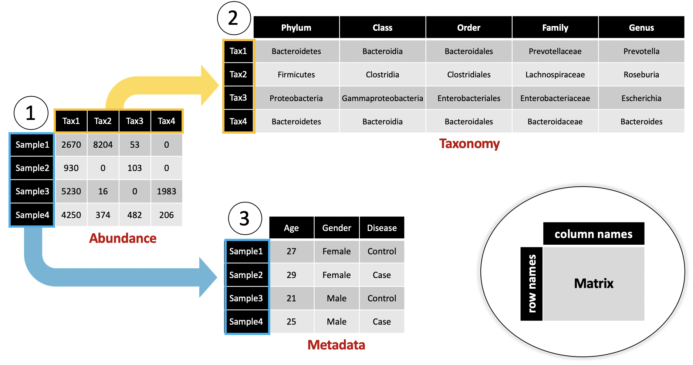
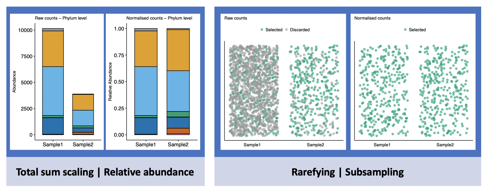
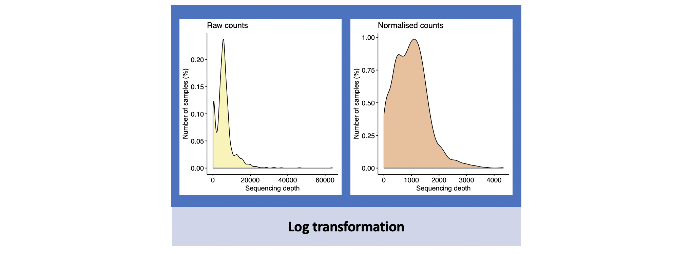
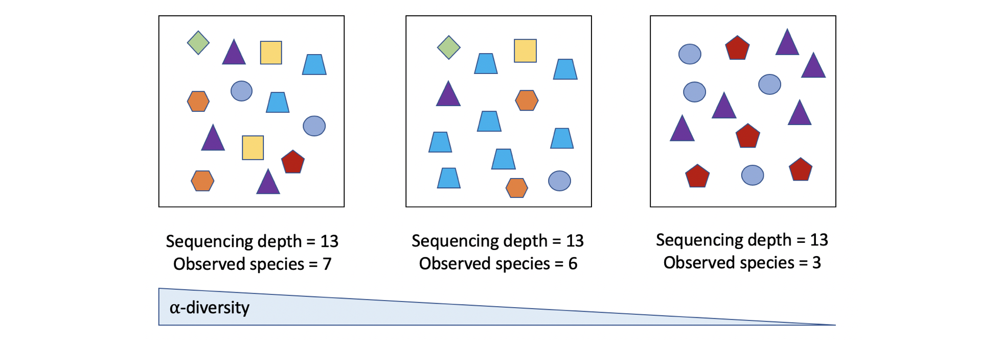
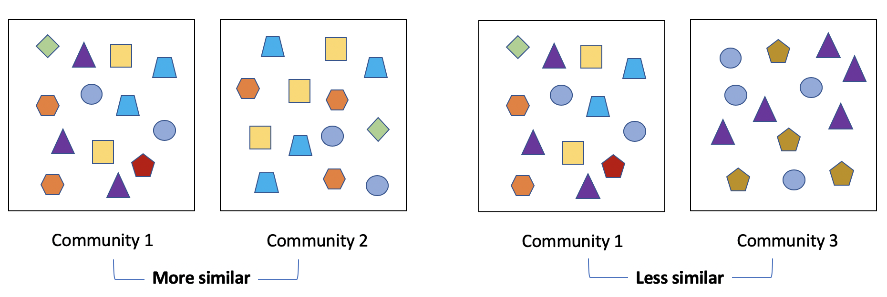

***

This tutorial will go over a basic analysis workflow using [HMP](https://www.ncbi.nlm.nih.gov/pmc/articles/PMC3564958/) data kindly provided in [phyloseq](https://journals.plos.org/plosone/article?id=10.1371/journal.pone.0061217#abstract0) format by [Paul J. McMurdie](https://github.com/joey711)   
Download the data [here](http://joey711.github.io/phyloseq-demo/HMPv35.RData)

***
   
*For pre-processing your own data, I recommend following this [DADA2 tutorial](https://benjjneb.github.io/dada2/tutorial.html).*

*If you need help getting your own data into phyloseq format, see [phyloseq data import tutorials](https://joey711.github.io/phyloseq/import-data.html).*   

***

The R package "phyloseq" is designed specifically for analysing microbiome data. For more information, see the [home page](http://joey711.github.io/phyloseq/). A phyloseq object holds all of the data necessary for the analysis in a single place. It can contain: metadata for the samples, the abundance table, taxonomic assignments, a phylogenetic tree, and reference sequences. See the schematic below for how these data are linked together in a phyloseq object.



```{r, include=FALSE}
knitr::opts_chunk$set(echo=TRUE, warning=FALSE, fig.align="center")
```

### Setup

Let's start by loading the packages we will be using.

```{r setup, message=FALSE, results='hide'}

pkgs <- c("tidyverse", "phyloseq", "ggpubr", "ggplot2", 
          "vegan", "reshape2", "DESeq2")
lapply(pkgs, require, character.only = TRUE)

```

We also need to define some settings for our plots. Use the color-blind-friendly palette from <http://www.cookbook-r.com>.

```{r}

theme_set(theme_bw()) 
color_pal <- c("#E69F00", "#56B4E9", "#009E73", "#F0E442", "#0072B2", "#D55E00", "#CC79A7")

```

The dataset we will be using contains 16S rRNA gene amplicon sequencing (16S profiling) data from the V3-V5 regions of the gene. It was acquired as part of the Human Microbiome Project (HMP). Details about the study design are [here](https://www.hmpdacc.org/micro_analysis/microbiome_analyses.php). It is important to note that this data was [pre-processed](https://www.hmpdacc.org/HMQCP/) using QIIME, a clustering approach that results in operational taxonomic units (OTUs), or groups of similar sequences. New methods have been developed to avoid needing to cluster sequences and to instead analyse amplicon sequence variants; these are generally recommended over OTU-based approaches. See this paper from [Callahan et al., 2017](https://www.nature.com/articles/ismej2017119) for more information. 

Load the data.

```{r}

load("HMPv35.RData")
HMPv35

```

This dataset contains 16S profiling data from 4743 samples with 9 metadata variables to describe these samples. Let's have a look at the metadata.

```{r}

ps_meta <- sample_data(HMPv35) %>%
  data.frame() # convert from phyloseq format
summary(ps_meta)

```

For each sample, we know the individual (`RSID`: random subject ID) that it corresponds to, which part of the body (`HMPbodysubsite`) it came from, which visit it was collected during (`visitno`), and the center (`RUNCENTER`) where the sequencing data was acquired. We also know whether the individual is a male or female (`sex`).

```{r}

n_distinct(ps_meta$RSID)

```

The samples originate from 235 subjects, so each individual was sampled from multiple body sites over multiple visits and samples were sequenced at various centers.

### Data quality check

Sequencing depth (number of reads per sample) is a major confounder in 16S profiling data analysis. Let's inspect our sequencing depths. First, we need to add this variable to our data frame. Then we can look at the distribution of sequencing depths by sample type (`fill="HMPbodysubsite"`) or sequencing center (`fill="RUNCENTER"`). 

```{r}

ps_meta$Sequencing_depth <- sample_sums(HMPv35) # sample_sums are sequencing depths

ggdensity(ps_meta,
          x = "Sequencing_depth",
          xlab = "Sequencing depth",
          y = "..count..",
          ylab = "Number of samples (%)",
          fill = "HMPbodysubsite",
          alpha = 0.4) +
  theme(legend.key.size = unit(3, "mm"), # resize legend so it fits in the figure
        legend.text = element_text(size = 6), legend.title = element_text(size = 7))

```

From this plot, we see that most of our samples have less than 10,000 reads but a few samples have 25,000-90,000 reads. It is also evident that two sample types (Left and Right Antecubital fossa) have much lower sequencing depths than the rest. Let's change `fill="HMPbodysubsite"` to `fill="RUNCENTER"`.

```{r}

ggdensity(ps_meta,
          x = "Sequencing_depth",
          xlab = "Sequencing depth",
          y = "..count..",
          ylab = "Number of Samples (%)",
          fill = "RUNCENTER",
          alpha = 0.4)

```

From this plot, we see that most samples were sequenced at 4 centers and that sequencing depth can vary between the centers.

### Subsetting Data

For the purposes of this tutorial, we will subset the data so that we are working with a smaller dataset. We will keep only saliva and stool samples sequenced at the top 4 centers and get rid of any samples with a low sequencing depth. We will use a threshold of 2,000 reads here.

```{r}

to_keep <- table(ps_meta$RUNCENTER) %>% # count samples from each center
  sort(decreasing = T) # order them from most to least samples

to_keep <- to_keep[1:4] %>% # keep top 4
  names() # extract center names

ps_obj <- HMPv35 %>%
  subset_samples(HMPbodysubsite %in% c("Saliva", "Stool") & # keep only saliva/stool samples
                   sample_sums(HMPv35) > 2000 & # keep samples with more than 2000 reads
                   RUNCENTER %in% to_keep) # keep samples from the 4 centers
ps_obj

```

We can check that our code worked.

```{r}

table(sample_data(ps_obj)$HMPbodysubsite) # which sample types remain?
min(sample_sums(ps_obj)) # what is the minimum sequencing depth?
table(sample_data(ps_obj)$RUNCENTER) # which centers remain?
n_distinct(sample_data(ps_obj)$RSID) # how many individuals are left?

```

We are left with 480 stool and saliva samples from 4 centers representing 205 individuals. We need to make sure there is just one sample per subject for each sample type. Repeated measure analysis is for another time!

```{r}

ps_meta <- sample_data(ps_obj) %>% # extract metadata from data subset
  data.frame() %>%
  arrange(RSID, visitno) %>% # sort by subject in order of visit number
  unite(col = to_filter, c("RSID", "HMPbodysubsite"), sep = "_", remove = F) %>% # new variable "RSID_subsite"
  filter(!duplicated(to_filter)) # only keep earliest visit for each subsite

ps_obj <- ps_obj %>%
  subset_samples(sample_names(ps_obj) %in% ps_meta$X.SampleID)
ps_obj

```

363 samples remain. Just a note: some subjects have "matching" samples that were taken at different visits. Depending on our research question, we might want to make sure that samples from the same individual were taken at the same time point, but we will leave this as is for the tutorial. Now we need to remove taxa that are no longer present in any of the samples.

```{r}

ps_obj <- ps_obj %>%
  filter_taxa(function(x) sum(x) > 0, prune = TRUE) # keep only taxa with more than 0 total counts
ps_obj

```

### Normalisations

Normalisation of 16S profiling data is widely discussed in the literature. The most commonly used methods are: total sum scaling (figure below, left panel), rarefying (figure below, right panel), and log transformation. However, since this data is compositional, alternative approaches such as centered log-ratio transformation have been suggested. See [Gloor et al., 2017](https://www.frontiersin.org/articles/10.3389/fmicb.2017.02224/full). Additional methods are discussed by [McMurdie and Holmes, 2014](https://www.ncbi.nlm.nih.gov/pmc/articles/PMC3974642/). There are many ways to normalise 16S profiling data, but we will keep it simple and use the traditional methods. The type of normalisation you need will also depend on the analysis you want to run.   

   
   
As you can see from the figure above neither of these methods are ideal, particularly when sequencing depths vary drastically between samples. In such a case, log transformation might be helpful.   

   
   
The distribution of sequencing depths is still not exactly normal, but it looks better. The following functions can be used for normalisations:   

* Relative abundance - `transform_sample_counts(ps_obj, function(x) { x/sum(x) })`   
    * `x/sum(x)` counts for each taxon are divided by total counts in the sample   
* Rarefy - `rarefy_even_depth(ps_obj)`   
* Log transformation - `transform_sample_counts(ps_obj, function(x) { log(x+1) })`   
    * `log(x+1)` log of counts for each taxon   
    * A pseudo count (`+1`) is added to avoid `log(0)`

### Alpha-diversity

Let's look at the diversity within samples and compare this between the different body sites. 

First, we need to normalise the data because alpha-diversity usually increases with sequencing depth. Samples with many more reads may look like they have a higher number of different bacteria present than samples with a low sequencing depth. We can illustrate this with a rarefaction curve.

```{r}

abund <- ps_obj %>%
  subset_samples(HMPbodysubsite == "Stool") %>% # only plot stool samples
  otu_table() %>% # extract abundance table
  as("matrix") %>% # convert from phyloseq format
  t() # transpose - rarecurve() wants samples in rows

rarecurve(abund, 
          step = 1000,
          label = F)

```

This plot shows that as the sequencing depth (Sample Size) gets higher, more species are observed. One way to overcome this is to normalise by subsampling to even sequencing depths. This is sort of like putting all of your counts for a sample in a bag and randomly pulling out a set number of counts so that all samples end up having the same total (refer to the "Rarefying | Subsampling" figure above). This approach is widely criticised because it can lead to throwing out huge amounts of data, but it remains one of the best (and most simple) ways to normalise before estimating alpha-diversity since some metrics rely on actual counts (integers).  

Rarefy the data

```{r}

ps_rar <- rarefy_even_depth(ps_obj, 
                            sample.size = min(sample_sums(ps_obj)), 
                            rngseed = 9375, # set this so that subsampling is reproducible
                            replace = F, 
                            trimOTUs = T)

```

Calculate alpha-diversities

```{r}

alpha_div <- ps_rar %>%
  estimate_richness(split = T, 
                    measures = c("Observed", "Shannon", "Simpson", "Fisher")) %>%
  mutate(X.SampleID = as.numeric(sample_names(ps_rar))) # add sample IDs
  
alpha_div <- right_join(ps_meta, # add metadata
                        alpha_div, 
                        by = "X.SampleID")

```

Plot the results

```{r}

alpha_div_long <- melt(alpha_div, 
                       measure.vars = c("Observed", "Shannon", "Simpson", "Fisher"))

ggboxplot(alpha_div_long,
          x = "variable",
          y = "value", 
          xlab = FALSE,
          ylab = FALSE,
          color = "HMPbodysubsite", 
          palette = color_pal,
          facet.by = "variable",
          scales = "free") +
  rremove("x.text") +
  rremove("x.ticks")

```

The trend is similar among the different metrics, so let's choose one and plot with stats. We first need to format the data to do a paired test since saliva and stool samples can come from the same subjects.

```{r}

df <- alpha_div_long %>%
  filter(variable == "Shannon") # consider only shannon index

to_keep <- df$RSID[duplicated(df$RSID)] # keep only subjects with matching samples
df <- subset(df, df$RSID %in% to_keep)

```

```{r}

ggpaired(df,
         x = "HMPbodysubsite",
         xlab = FALSE,
         y = "value",
         ylab = "Shannon Index",
         id = "RSID", # for pairing 
         color = "HMPbodysubsite", 
         palette = color_pal,
         line.color = "grey", 
         line.size = 0.2) +
  stat_compare_means(comparisons = list(c("Saliva", "Stool")), 
                     method = "t.test", 
                     paired = T) +
  theme(legend.position = "none")

```

Saliva samples are more diverse than stool samples.

### Beta-diversity

Next we will look at differences in microbial community structure between samples. 
   

For this, rarefying is not a recommended normalisation method. We will instead try total sum scaling (relative abundance) and log transformation with the commonly used Bray-Curtis dissimilarity. There are many options for both distance metric and ordination method; you should explore which are best for your data. It is also important to compare both non-phylogenetic (like Bray-Curtis) and phylogenetic (like UniFrac) metrics. Phylogenetic beta-diversity metrics consider the evolutionary relationships between taxa in addition to their abundances. The same is true for alpha-diversity. Faith's Phylogenetic Diversity (`picante::pd()`) is widely used for calculating phylogenetic alpha-diversity.   

Let's define a function to do the beta-diversity and plotting so we avoid repetition in our code.

```{r}

plot_bdiv <- function(ps_norm, # normalised phyloseq object
                      bdiv, # distance metric for beta-diversity
                      ordination, # ordination method
                      color_var, # variable to color samples by
                      title) {

  bdiv_mat <- phyloseq::distance(ps_norm, bdiv) # calculate beta-diversity
  ord <- ordinate(ps_norm, # ordinate beta-diversity
                  method = ordination, 
                  distance = bdiv_mat) 
  p <- plot_ordination(ps_norm, # plot
                       ord, 
                       color = color_var, 
                       title = title) + 
    scale_color_manual(values = color_pal)
  return(p)
  
}

```

Let's see how different normalisations affect Bray-Curtis dissimilarities.

```{r}

ps_rel_abund <- ps_obj %>%
  transform_sample_counts(function(x) { x/sum(x) })
ps_log <- ps_obj %>%
  transform_sample_counts(function(x) { log(x+1) })

```

```{r, results="hide"}

p_rel <- plot_bdiv(ps_rel_abund,
                   bdiv = "bray",
                   ordination = "PCoA",
                   color_var = "HMPbodysubsite",
                   title = "Relative Abundance")
p_log <- plot_bdiv(ps_log,
                   bdiv = "bray",
                   ordination = "PCoA",
                   color_var = "HMPbodysubsite",
                   title = "Log transformed")

```

```{r}

ggarrange(p_rel, p_log, common.legend = T)

```

It looks like there is a lot of variation within the saliva samples. Let's see if this can be attributed to the different sequencing centers. We just need to change the color of the points.

```{r, results="hide"}

p_rel <- plot_bdiv(ps_rel_abund,
                   bdiv = "bray",
                   ordination = "PCoA",
                   color_var = "RUNCENTER",
                   title = "Relative Abundance")
p_log <- plot_bdiv(ps_log,
                   bdiv = "bray",
                   ordination = "PCoA",
                   color_var = "RUNCENTER",
                   title = "Log transformed")

```

```{r}

ggarrange(p_rel, p_log, common.legend = T)

```

Saliva samples from "JCVI" seem to have distinct bacterial profiles from those sequenced at the other centers. Let's take a closer look at the saliva samples.

```{r}

ps_saliva <- ps_obj %>%
  subset_samples(HMPbodysubsite == "Saliva")

ps_saliva_log <- ps_saliva %>%
  transform_sample_counts(function(x) { log(x+1) })

```

We can also check another ordination method.

```{r, results="hide"}

p_pcoa <- plot_bdiv(ps_saliva_log,
                   bdiv = "bray",
                   ordination = "PCoA",
                   color_var = "RUNCENTER",
                   title = "PCoA")
p_nmds <- plot_bdiv(ps_saliva_log,
                   bdiv = "bray",
                   ordination = "NMDS",
                   color_var = "RUNCENTER",
                   title = "NMDS")

```

```{r}

ggarrange(p_pcoa, p_nmds, common.legend = T)

```

We can then test the significance of this difference in beta-diversity.

```{r}

bdiv_mat <- phyloseq::distance(ps_saliva_log, "bray")

adonis(bdiv_mat ~ RUNCENTER, data.frame(sample_data(ps_saliva_log)))

```

*P* = 0.001 but we also need to check that the dispersions are similar between the groups. This should be non-significant for us to have confidence in the `adonis()` results.

```{r}

disp <- betadisper(bdiv_mat, sample_data(ps_saliva_log)$RUNCENTER)
permutest(disp)

```

The dispersions are significantly different between groups which can have a large effect on the `adonis()` results. So let's do univariate tests looking at individual taxa to confirm why samples from "JCVI" differ from the rest.

### Differential abundance

First, we need to find out which taxa differ between our groups of interest. Let's look at high-level differences by combining counts at the family level. We can also remove low abundance taxa (filtering criteria should be based on your data) because these probably won't differ significantly between the groups. Finally, we will log transform the data and extract normalised counts as a data frame.

```{r}

fam_abund <- ps_saliva %>%
  tax_glom("Family") %>% # combine counts at family level
  # only keep families with at least 5 counts in 10% of samples
  filter_taxa(function(x) { sum(x >= 5) > 0.1*nsamples(ps_saliva) }, prune = T) %>% 
  transform_sample_counts(function(x) { log(x+1)}) %>%
  psmelt() # convert phyloseq object to data frame

```

The function `ps_melt()` takes the metadata, abundance table, and taxonomy from the phyloseq object and combines them into long format. This means that for every taxon, there are as many rows as samples so all abundance values are in a single column rather than a matrix. The counts are in the column `Abundance` and we are interested in the taxonomic rank `Family`. Let's plot the abundances.

```{r}

ggviolin(fam_abund, 
         x = "RUNCENTER", 
         y = "Abundance",
         ylab = "Log(Abundance)",
         facet.by = "Family", 
         fill = "RUNCENTER", 
         palette = color_pal, 
         panel.labs.font = list(size = 6)) +
  theme(legend.position = "none", 
        axis.text = element_text(size = 5.5))

```

One obvious difference in the "JCVI" samples is lower abundance of *Campylobacteraceae*. Let's test this hypothesis.

```{r}

df <- fam_abund %>%
  filter(Family == "Campylobacteraceae")

ggviolin(df, 
         x = "RUNCENTER", 
         y = "Abundance", 
         ylab = "Log(Abundance)", 
         fill = "RUNCENTER", 
         palette = color_pal) +
  theme(legend.position = "none") +
  stat_compare_means(comparisons = list(c("JCVI", "BCM"),
                                        c("JCVI", "BI"),
                                        c("JCVI", "WUGC")), 
                     method = "wilcox.test") # non-parametric test!

```

#### DESeq2

Another way to calculate differential abundance is using the package "DESeq2". The method was developed for [differential analysis of RNA-seq data](https://www.ncbi.nlm.nih.gov/pmc/articles/PMC4302049/) (which is also count data) but has been applied to 16S profiling data too. DESeq2 has its own normalisation method, so we need to provide raw counts.   

We also need to add a new metadata variable since we only want to compare "JCVI" samples with "non-JCVI" samples.

```{r}

sample_data(ps_saliva)$JCVI <- ifelse(sample_data(ps_saliva)$RUNCENTER == "JCVI", "JCVI", "other")
sample_data(ps_saliva)$JCVI <- factor(sample_data(ps_saliva)$JCVI, levels = c("other", "JCVI")) # other = ref

```

Next, we want to apply a prevalence filter and run DESeq2.

```{r, warning=FALSE, results="hide"}

ds <- ps_saliva %>%
  # only keep taxa present in 10% of samples
  filter_taxa(function(x) { sum(x > 0) > 0.10*nsamples(ps_saliva) }, prune = T) %>% 
  phyloseq_to_deseq2(~ JCVI) %>% # convert to deseq object
  DESeq(sfType = "poscounts") # run deseq

```

We can extract the differential abundance results for plotting and add taxonomic assignments since the OTU names are not very informative.

```{r}

ds_res <- results(ds) %>%
  data.frame() %>%
  mutate(OTU = row.names(.)) # add otu names

tax <- ps_saliva %>%
  tax_table() %>%
  as("matrix") %>%
  data.frame() %>%
  mutate(OTU = row.names(.))

ds_res <- left_join(ds_res, tax, by = "OTU")

```

The output is a data frame with one row per taxon and all the stats for that taxon. Let's plot the top significant results.

```{r}

ds_res <- ds_res %>% 
  mutate(Significance = ifelse(padj < 0.05, "SIG", "NS"), # label significant taxa
         SEmin = log2FoldChange-lfcSE, # add values for error bars
         SEmax = log2FoldChange+lfcSE,
         Genus = as.character(Genus), # remove factor
         Genus = replace_na(Genus, " Unclassified")) # change NA to unclassified

to_plot <- ds_res %>%
  arrange(padj) # lowest p values on top

to_plot <- to_plot[1:25,] %>% # keep top 25
  arrange(desc(log2FoldChange)) %>% # order by effect size
  mutate(OTU = factor(OTU, levels = OTU)) # factor so that order stays same in plot

```

```{r}

ggplot(to_plot,
       aes(y = log2FoldChange, 
           x = OTU, 
           color = Genus)) +
  geom_errorbar(aes(ymax = SEmax, 
                    ymin = SEmin), 
                color = "black", 
                width = 0.3) +
  geom_point(size = 3) +
  geom_hline(yintercept = 0, 
             linetype = 2, 
             alpha = 0.7) +
  coord_flip() +
  scale_color_manual(values = c("grey", "black", color_pal)) + # make unclassified grey and Campylobacter black
  theme(axis.text.y = element_blank(),
        axis.ticks.y = element_blank())

```

We can see that differential abundance at the OTU level also shows significant reductions in *Campylobacter spp.* (*Campylobacteraceae* family). Now let's go back to the counts and look at the distributions between the centers.

```{r}

to_keep <- to_plot$OTU[to_plot$Genus == "Campylobacter"] %>% as.character() # otu names for Campylobacter spp.

df <- counts(ds, normalized = TRUE) # get normalised counts from deseq object
df <- df[row.names(df) %in% to_keep,]
df <- melt(df) %>%
  left_join(data.frame(sample_data(ps_saliva)), by = c("Var2" = "X.SampleID")) # add metadata

```

```{r}

ggplot(df, 
       aes(JCVI, value)) +
  geom_jitter(aes(color = JCVI), size = 1) +
  scale_color_manual(values = color_pal) + 
  theme(legend.position = "none",
        axis.title.x = element_blank()) +
  ylab("Normalised counts") +
  facet_wrap(~Var1)

```

**Group discussion**: What are potential explanations for what we are seeing?

### Session info

```{r}
sessionInfo()
```

### References

* Callahan, B. J., McMurdie, P. J., & Holmes, S. P. (2017). Exact sequence variants should replace operational taxonomic units in marker-gene data analysis. *The Isme Journal*, 11, 2639. [doi:10.1038/ismej.2017.119](https://www.nature.com/articles/ismej2017119)    
* Gloor, G. B., Macklaim, J. M., Pawlowsky-Glahn, V., & Egozcue, J. J. (2017). Microbiome Datasets Are Compositional: And This Is Not Optional. *Frontiers in Microbiology*, 8, 2224. [doi:10.3389/fmicb.2017.02224](https://www.frontiersin.org/articles/10.3389/fmicb.2017.02224/full)  
* Love, M. I., Huber, W., & Anders, S. (2014). Moderated estimation of fold change and dispersion for RNA-seq data with DESeq2. *Genome Biology*, 15(12), 550. [doi:10.1186/s13059-014-0550-8](https://www.ncbi.nlm.nih.gov/pmc/articles/PMC4302049/)  
* McMurdie, P. J., & Holmes, S. (2013). phyloseq: An R Package for Reproducible Interactive Analysis and Graphics of Microbiome Census Data. *PLoS ONE*, 8(4), e61217. [doi:10.1371/journal.pone.0061217](https://journals.plos.org/plosone/article?id=10.1371/journal.pone.0061217#abstract0)  
* McMurdie, P. J., & Holmes, S. (2014). Waste not, want not: why rarefying microbiome data is inadmissible. *PLoS Computational Biology*, 10(4), e1003531-e1003531. [doi:10.1371/journal.pcbi.1003531](https://www.ncbi.nlm.nih.gov/pmc/articles/PMC3974642/)  
* The Human Microbiome Project Consortium. (2012). Structure, function and diversity of the healthy human microbiome. *Nature*, 486(7402), 207-214. [doi:10.1038/nature11234](https://www.ncbi.nlm.nih.gov/pmc/articles/PMC3564958/)
